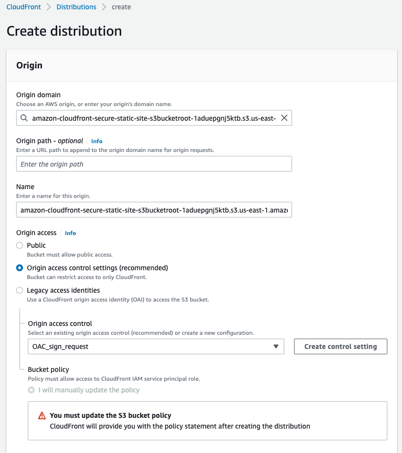

# The Professional Way to Host Static Content on AWS using Terraform

In an idea world, deploying a static website content into a S3 bucket, clicking "Make Public" and share the link. In that world, there are no security audit, no latency issues for user across the globe and no such thing as an "unsecured connection" warning in the browser.

In real time environment, "Public S3 Buckets" are often one way ticket to security meeting you do not want to attend. For professional grade deployment, you need:
* **Zero Public Access:** Keeping our storage origin locked down and private.
* **Global Speed:** Serving content from the edge, closer to the user.
* **Enforced Encryption:** Redirecting every visitor to https:// automatically.

In this post, I’m moving away from basic Terraform syntax and diving into a Real-Time Scenario: architecting a secure, private S3 origin fronted by Amazon CloudFront using Origin Access Control (OAC).

# The Architecture
To solve these real-world requirements, we aren't just deploying one resource. We are building a "handshake" between:
* **The Vault (S3):** Where our files live, completely private.
* **The Gatekeeper (CloudFront OAC):** The specialized permission that lets only our CDN inside.
* **The Messenger (CloudFront Distribution):** The service that delivers our site via HTTPS.

# The Implementation 
1. Amazon Simple Storage Service (Amazon S3)
Amazon Simple Storage Service (Amazon S3) is an object storage service offering industry-leading scalability, data availability, security, and performance. Millions of customers of all sizes and industries store, manage, analyze, and protect any amount of data for virtually any use case, such as data lakes, cloud-native applications, and mobile apps. With cost-effective storage classes and easy-to-use management features, you can optimize costs, organize and analyze data, and configure fine-tuned access controls to meet specific business and compliance requirements.

# Lets create a S3 bucket in terraform
```hcl 

resource "aws_s3_bucket" "s3_bucket" {
  bucket = "my-static-bucket" # Name of the bucket. If omitted, Terraform will assign a random, unique name

  tags = {
    Name        = "My bucket"
    Environment = "Dev"
  }
}
```
Remember: 
* Bucket name is unique
* Bucket name must be lowercase and less than or equal to 63 characters in length.
* **force_destroy** - (optional, default = false): Boolean that indicates all object (including any locked objects) should be deleted from the bucket when the bucket is destroyed so that the bucket can be destroyed without error. 

Now that, we have a S3 bucket, lets understand about the blocking public access

# Locking the Front Door | Make the S3 Bucket Private
Making the S3 bucket private is good but to make it impossible to be public makes it awesome. Even if someone tries to change it to public, the resource will override and block it. 
[Read More]https://registry.terraform.io/providers/hashicorp/aws/latest/docs/resources/s3_bucket_public_access_block
[Read more about blocking public access to your amazon s3] https://docs.aws.amazon.com/AmazonS3/latest/userguide/access-control-block-public-access.html

```hcl 
## Create a resource to restrict public access to the S3 bucket
resource "aws_s3_bucket_public_access_block" "static_site_public_access_block" {
  bucket = aws_s3_bucket.static_site.id # Reference the S3 bucket created above

  block_public_acls       = true # Block public ACLs (Access Control Lists) to prevent unauthorized access
  block_public_policy     = true # Block public bucket policies to prevent unauthorized access
  ignore_public_acls      = true # Ignore public ACLs to prevent unauthorized access
  restrict_public_buckets = true # Restrict public bucket policies to prevent unauthorized access
}
```

# Modern Handshake (CloudFront OAC)
Amazon CloudFront is a global content delivery network that securely delivers applications, websites, videos, and APIs to viewers across the globe in milliseconds.  Leverage CloudFront’s origin access identity (OAI) to secures S3 origin access to CloudFront only.
When using OAC, a typical request and response workflow will be:

1. A client sends HTTP or HTTPS requests to CloudFront
2. CloudFront edge locations receive the requests. If the requested object is not already cached, CloudFront signs the requests using OAC signing protocol
3. S3 origins authenticate, authorize, or deny the requests.
4. When configuring OAC,  “Do not sign requests”, “Sign requests”, and sign requests. For this case, do not choose, Do not override authorization header.

# Configuring OAC when creating a new CloudFront distribution

Once the distribution is successfully created, you must update the s3 bucket policy. Before that, lets create OAC with terraform.

 
